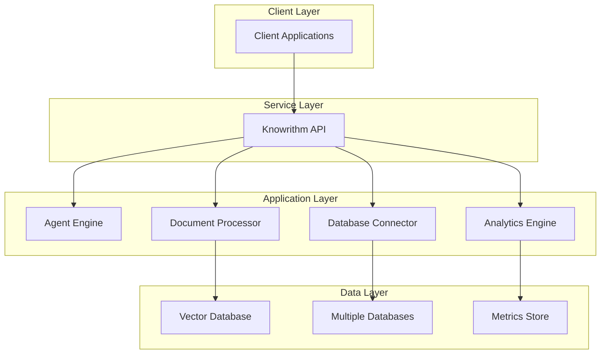

# Welcome to Knowrithm Documentation

**Build, train, and deploy intelligent AI agents with advanced analytics capabilities.**

Knowrithm is a comprehensive platform for creating custom chatbots and virtual assistants that can be seamlessly integrated into websites, manage leads, process documents, and provide detailed performance analytics.

## What is Knowrithm?

Knowrithm enables businesses to create specialized AI agents that can:
- **Build Custom AI Agents**: Create specialized chatbots tailored to your business needs.
- Process and understand your business documents
- Connect to your existing databases
- Handle customer inquiries intelligently  
- Track and convert leads automatically
- Provide detailed analytics on performance
- Scale across multiple departments and use cases

## Quick Navigation

<table data-view="cards">
  <thead>
    <tr>
      <th></th>
      <th></th>
      <th data-hidden data-card-target data-type="content-ref"></th>
    </tr>
  </thead>
  <tbody>
    <tr>
      <td><strong>Getting Started</strong></td>
      <td>Install the SDK and create your first agent</td>
      <td><a href="getting-started/">getting-started</a></td>
    </tr>
    <tr>
      <td><strong>Python SDK</strong></td>
      <td>Complete Python SDK reference and examples.</td>
      <td><a href="python-sdk/">python-sdk</a></td>
    </tr>
    <tr>
      <td><strong>API Reference</strong></td>
      <td>Complete REST API documentation</td>
      <td><a href="api-reference/">api-reference</a></td>
    </tr>
    <tr>
      <td><strong>Platform Guide</strong></td>
      <td>Architecture, deployment, and administration.</td>
      <td><a href="platform-guide/">platform-guide</a></td>
    </tr>
    <tr>
      <td><strong>Integrations</strong></td>
      <td>Website widgets, webhooks, and third-party tools.</td>
      <td><a href="integrations/">integrations</a></td>
    </tr>
    <tr>
      <td><strong>Tutorials</strong></td>
      <td>Step-by-step guides and real-world examples.</td>
      <td><a href="tutorials/">tutorials</a></td>
    </tr>
  </tbody>
</table>

## Core Features

### Multi-Agent Management  
Create specialized chatbots for different business functions - customer support, sales, technical assistance, and more.

### Advanced Data Integration
- **Documents**: Upload PDFs, Word docs, text files, and more
- **Databases**: Connect PostgreSQL, MySQL, SQLite, MongoDB
- **Websites**: Train agents on your website content
- **OCR**: Extract text from scanned documents and images.

### Lead Management & Analytics
- Track customer inquiries and conversions
- Comprehensive CRM integration
- Detailed performance metrics
- Export data in JSON/CSV formats

### Enterprise Security  
- Multi-tenant architecture with complete data isolation
- JWT-based authentication
- Role-based access control
- Audit logging and compliance features.

### Real-time Analytics
- Agent performance monitoring
- Conversation analytics
- Lead conversion tracking
- System health and usage metrics

## Use Cases

| Industry | Application | Benefits |
|----------|-------------|----------|
| **E-commerce** | Product recommendation bots | Increase sales, reduce support tickets |
| **SaaS** | Onboarding assistants | Improve user adoption, track engagement |
| **Healthcare** | Patient inquiry systems | 24/7 availability, HIPAA compliance |
| **Education** | Course assistants | Personalized learning, progress tracking |
| **Finance** | Support bots | Secure transactions, compliance tracking |
| **Real Estate** | Property inquiry systems | Lead qualification, automated follow-ups |

## Architecture Overview



## Getting Started in 5 Minutes

1. **Install the Python SDK**
   ```bash
   pip install knowrithm-py
   ```

2. **Initialize the client**
   ```python
   from knowrithm_py.knowrithm.client import KnowrithmClient
   
   client = KnowrithmClient(
       api_key="your-api-key",
       api_secret="your-api-secret"
   )
   ```

3. **Create your first agent**
   ```python
   from knowrithm_py.services.agent import AgentService
   
   agent_service = AgentService(client)
   agent = agent_service.create({
       "name": "Customer Support Bot",
       "description": "AI agent for customer support"
   })
   ```

4. **Start a conversation**
   ```python
   from knowrithm_py.services.conversation import ConversationService
   
   conversation_service = ConversationService(client)
   conversation = conversation_service.create(
       agent_id=agent['id'],
       entity_type="USER"
   )
   ```

{{ content-ref url="getting-started/quick-start.md" }}
[quick-start.md](getting-started/quick-start.md)
{{ endcontent-ref }}

## Community & Support

<table data-view="cards">
  <thead>
    <tr>
      <th></th>
      <th></th>
      <th data-hidden data-card-target data-type="content-ref"></th>
    </tr>
  </thead>
  <tbody>
    <tr>
      <td><strong>Discord</strong></td>
      <td>Join our community for discussions and support</td>
      <td><a href="https://discord.gg/cHHWfghJrR">https://discord.gg/cHHWfghJrR</a></td>
    </tr>
    <tr>
      <td><strong>Email Support</strong></td>
      <td>Get direct help from our team</td>
      <td><a href="mailto:support@knowrithm.org">support@knowrithm.org</a></td>
    </tr>
    <tr>
      <td><strong>GitHub Issues</strong></td>
      <td>Report bugs and request features</td>
      <td><a href="https://github.com/Knowrithm/knowrithm-py/issues">GitHub Issues</a></td>
    </tr>
    <tr>
      <td><strong>FAQ</strong></td>
      <td>Find answers to common questions</td>
      <td><a href="resources/faq.md">faq.md</a></td>
    </tr>
  </tbody>
</table>

## What's Next?

Ready to build your first AI agent? Check out our guides:

- Set up your development environment
- Create and train your first agent
- Add a chatbot to your website
- Track performance and conversions

---

{{ hint style="success" }}
**New to Knowrithm?** Start with our [Quick Start Guide](getting-started/quick-start.md) to create your first AI agent in under 10 minutes!
{{ endhint }}

{{ hint style="info" }}
**Need help?** Our [Discord community](https://discord.gg/cHHWfghJrR) is active and ready to help with any questions you might have.
{{ endhint }}