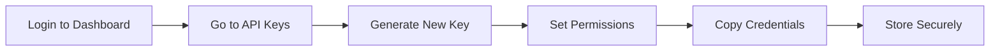

# Authentication Guide

Learn how to securely authenticate with the Knowrithm API using API keys and manage your credentials effectively.

## Overview

Knowrithm uses API key authentication to secure access to your agents, data, and analytics. This guide covers:

- Creating and managing API keys.
- Setting up authentication in your code
- Security best practices
- Troubleshooting authentication issues

## Getting Your API Credentials

### Step 1: Access Your Dashboard

1. Log in to your account at [app.knowrithm.org](https://app.knowrithm.org).
2. Navigate to **Settings** → **API Keys**
3. Click **"Generate New API Key"**

### Step 2: Create an API Key



When creating an API key, you'll need to specify:

| Field | Description | Example |
|---|---|---|
| **Name** | A descriptive name for the key. | "Production Bot", "Development" |
| **Permissions** | The access level (Read, Write, Admin). | Read + Write for most use cases. |
| **Expiry** | When the key expires (optional). | 90 days, 1 year, or never. |
| **IP Restrictions** | Limit access to specific IP addresses (optional). | Your server's IP address. |
 
### Step 3: Copy Your Credentials

After creation, you'll receive:

```json
{
  "api_key": "ak_1234567890abcdef",
  "api_secret": "as_abcdef1234567890xyz",
  "created_at": "2024-01-15T10:30:00Z",
  "expires_at": "2024-04-15T10:30:00Z"
}
```

{{ hint style="danger" }}
**Important**: Copy both the API key and secret immediately. The secret is only shown once and cannot be recovered.
{{ endhint }} 

## Setting Up Authentication

### Method 1: Environment Variables (Recommended)

Create a `.env` file in your project root:

```bash 
# .env
KNOWRITHM_API_KEY=ak_1234567890abcdef
KNOWRITHM_API_SECRET=as_abcdef1234567890xyz
KNOWRITHM_BASE_URL=https://app.knowrithm.org
```

Use in your Python code:

```python
import os
from dotenv import load_dotenv
from knowrithm_py.knowrithm.client import KnowrithmClient

# Load environment variables
load_dotenv()

# Initialize client
client = KnowrithmClient(
    api_key=os.getenv('KNOWRITHM_API_KEY'),
    api_secret=os.getenv('KNOWRITHM_API_SECRET'),
    base_url=os.getenv('KNOWRITHM_BASE_URL', 'https://app.knowrithm.org')
)
```

### Method 2: Direct Initialization

```python
from knowrithm_py.knowrithm.client import KnowrithmClient

client = KnowrithmClient(
    api_key="ak_1234567890abcdef",
    api_secret="as_abcdef1234567890xyz",
    base_url="https://app.knowrithm.org"
)
```

### Method 3: Configuration File

Create a `config.py` file:

```python
# config.py
KNOWRITHM_CONFIG = {
    'api_key': 'ak_1234567890abcdef',
    'api_secret': 'as_abcdef1234567890xyz',
    'base_url': 'https://app.knowrithm.org',
    'timeout': 30,
    'retry_attempts': 3
}
```

Use in your application:

```python
from config import KNOWRITHM_CONFIG
from knowrithm_py.knowrithm.client import KnowrithmClient

client = KnowrithmClient(**KNOWRITHM_CONFIG)
```

## Validating Authentication

Always validate your credentials before using them:

```python
from knowrithm_py.services.auth import AuthService

def validate_credentials():
    """Validate API credentials"""
    try:
        auth_service = AuthService(client)
        validation = auth_service.validate_credentials()
        
        if validation.get('valid'):
            print("Authentication successful!")
            print(f"User: {validation.get('user', {}).get('email')}")
            print(f"Company: {validation.get('company', {}).get('name')}")
            return True
        else:
            print("❌ Invalid credentials")
            return False
            
    except Exception as e:
        print(f"Authentication error: {e}")
        return False

# Validate before using other services
if validate_credentials():
    # Proceed with your application
    pass
else:
    # Handle authentication failure
    exit(1)
```

## API Key Management

### Using the SDK to Manage Keys

```python
from knowrithm_py.services.auth import AuthService

auth_service = AuthService(client)

# List existing API keys
api_keys = auth_service.get_api_keys()
print(f"You have {len(api_keys)} active API keys")

for key in api_keys:
    print(f"- {key['name']}: {key['key'][:10]}... (expires: {key.get('expires_at', 'never')})")

# Create a new API key
new_key = auth_service.create_api_key(
    name="Analytics Dashboard",
    permissions={
        "read": True,
        "write": False,
        "admin": False
    },
    expires_in_days=90
)

print(f"New key created: {new_key['key']}")

# Get information about current key
key_info = auth_service.get_api_key_info()
print(f"Current key permissions: {key_info['permissions']}")
print(f"Usage this month: {key_info['usage']['requests_this_month']}")

# Revoke an API key
auth_service.revoke_api_key(key_id="key_123")
```

### Key Rotation Best Practices

```python
import schedule
import time
from datetime import datetime, timedelta

def rotate_api_key():
    """Rotate API key every 90 days"""
    auth_service = AuthService(client)
    
    # Create new key
    new_key = auth_service.create_api_key(
        name=f"Auto-rotated-{datetime.now().strftime('%Y%m%d')}",
        permissions={"read": True, "write": True, "admin": False},
        expires_in_days=90
    )
    
    # Update your configuration
    # (In production, you'd update your secrets management system)
    print(f"New API key created: {new_key['key'][:10]}...")
    
    # Revoke old key after grace period
    # schedule.every(7).days.do(revoke_old_key, old_key_id)

# Schedule rotation every 80 days (10 days before expiry)
schedule.every(80).days.do(rotate_api_key)
```

## Security Best Practices

### 1. Environment-Specific Keys

Use different API keys for different environments:

```python
import os

# Environment-specific configuration
ENV = os.getenv('ENVIRONMENT', 'development')

if ENV == 'production':
    api_key = os.getenv('PROD_KNOWRITHM_API_KEY')
    api_secret = os.getenv('PROD_KNOWRITHM_API_SECRET')
elif ENV == 'staging':
    api_key = os.getenv('STAGING_KNOWRITHM_API_KEY')
    api_secret = os.getenv('STAGING_KNOWRITHM_API_SECRET')
else:
    api_key = os.getenv('DEV_KNOWRITHM_API_KEY')
    api_secret = os.getenv('DEV_KNOWRITHM_API_SECRET')

client = KnowrithmClient(
    api_key=api_key,
    api_secret=api_secret,
    base_url="https://app.knowrithm.org"
)
```

### 2. Secure Storage

#### Using AWS Secrets Manager

```python
import boto3
import json
from botocore.exceptions import ClientError

def get_secret(secret_name):
    """Retrieve API credentials from AWS Secrets Manager"""
    session = boto3.session.Session()
    client = session.client(
        service_name='secretsmanager',
        region_name='us-east-1'
    )
    
    try:
        response = client.get_secret_value(SecretId=secret_name)
        secret = json.loads(response['SecretString'])
        return secret['api_key'], secret['api_secret']
    except ClientError as e:
        raise e

# Usage
api_key, api_secret = get_secret('knowrithm/production/api-keys')
```

#### Using Azure Key Vault

```python
from azure.keyvault.secrets import SecretClient
from azure.identity import DefaultAzureCredential

def get_credentials_from_keyvault():
    """Retrieve credentials from Azure Key Vault"""
    credential = DefaultAzureCredential()
    client = SecretClient(
        vault_url="https://your-vault.vault.azure.net/",
        credential=credential
    )
    
    api_key = client.get_secret("knowrithm-api-key").value
    api_secret = client.get_secret("knowrithm-api-secret").value
    
    return api_key, api_secret
```

### 3. IP Restrictions

Restrict API key usage to specific IP addresses:

```python
# When creating an API key
new_key = auth_service.create_api_key(
    name="Server API Key",
    permissions={"read": True, "write": True},
    ip_restrictions=[
        "192.168.1.100",    # Your server IP
        "10.0.0.0/8"        # Your VPN range
    ]
)
```

### 4. Request Signing (Advanced)

For maximum security, implement request signing:

```python
import hmac
import hashlib
import base64
from datetime import datetime

def sign_request(method, url, body, api_secret, timestamp=None):
    """Sign API requests with HMAC"""
    if timestamp is None:
        timestamp = str(int(datetime.utcnow().timestamp()))
    
    # Create signature string
    signature_string = f"{method}\n{url}\n{body}\n{timestamp}"
    
    # Generate signature
    signature = hmac.new(
        api_secret.encode('utf-8'),
        signature_string.encode('utf-8'),
        hashlib.sha256
    ).hexdigest()
    
    return signature, timestamp

# Usage in requests
method = "POST"
url = "/api/v1/agents"
body = '{"name": "Secure Agent"}'

signature, timestamp = sign_request(method, url, body, api_secret)

headers = {
    "Authorization": f"Bearer {api_key}",
    "X-Timestamp": timestamp,
    "X-Signature": signature
}
```

## Error Handling

### Common Authentication Errors

```python
from knowrithm_py.exceptions import AuthenticationError, AuthorizationError

def handle_auth_errors():
    """Handle common authentication errors"""
    try:
        client = KnowrithmClient(
            api_key=api_key,
            api_secret=api_secret
        )
        
        # Test the connection
        auth_service = AuthService(client)
        validation = auth_service.validate_credentials()
        
    except AuthenticationError as e:
        if "invalid_api_key" in str(e):
            print("Invalid API key - check your credentials")
        elif "expired" in str(e):
            print("API key has expired - generate a new one")
        elif "revoked" in str(e):
            print("API key has been revoked")
        else:
            print(f"Authentication failed: {e}")
            
    except AuthorizationError as e:
        print(f"Insufficient permissions: {e}")
        print("Check your API key permissions in the dashboard")
        
    except Exception as e:
        print(f"Unexpected error: {e}")

# Use it
handle_auth_errors()
```

### Automatic Token Refresh

```python
import time
from functools import wraps

def retry_on_auth_failure(max_retries=3):
    """Decorator to retry operations on authentication failure"""
    def decorator(func):
        @wraps(func)
        def wrapper(*args, **kwargs):
            for attempt in range(max_retries):
                try:
                    return func(*args, **kwargs)
                except AuthenticationError as e:
                    if attempt == max_retries - 1:
                        raise e
                    
                    print(f"Auth failed, retrying... (attempt {attempt + 1})")
                    time.sleep(2 ** attempt)  # Exponential backoff
                    
                    # Re-validate credentials
                    validate_credentials()
                    
            return None
        return wrapper
    return decorator

# Usage
@retry_on_auth_failure()
def create_agent(agent_data):
    agent_service = AgentService(client)
    return agent_service.create(agent_data)
```

## Testing Authentication

### Unit Tests

```python
import unittest
from unittest.mock import patch, MagicMock
from knowrithm_py.knowrithm.client import KnowrithmClient

class TestAuthentication(unittest.TestCase):
    
    def setUp(self):
        self.api_key = "test_key"
        self.api_secret = "test_secret"
    
    def test_client_initialization(self):
        """Test client initializes with valid credentials"""
        client = KnowrithmClient(
            api_key=self.api_key,
            api_secret=self.api_secret
        )
        
        self.assertIsNotNone(client)
        self.assertEqual(client.api_key, self.api_key)
    
    @patch('knowrithm_py.services.auth.AuthService.validate_credentials')
    def test_credential_validation(self, mock_validate):
        """Test credential validation"""
        mock_validate.return_value = {'valid': True}
        
        client = KnowrithmClient(
            api_key=self.api_key,
            api_secret=self.api_secret
        )
        
        from knowrithm_py.services.auth import AuthService
        auth_service = AuthService(client)
        result = auth_service.validate_credentials()
        
        self.assertTrue(result['valid'])
    
    def test_invalid_credentials(self):
        """Test handling of invalid credentials"""
        with self.assertRaises(ValueError):
            KnowrithmClient(api_key="", api_secret="")

if __name__ == '__main__':
    unittest.main()
```

### Integration Tests

```python
def test_end_to_end_authentication():
    """Test complete authentication flow"""
    # Initialize client
    client = KnowrithmClient(
        api_key=os.getenv('TEST_KNOWRITHM_API_KEY'),
        api_secret=os.getenv('TEST_KNOWRITHM_API_SECRET')
    )
    
    # Validate credentials
    auth_service = AuthService(client)
    validation = auth_service.validate_credentials()
    
    assert validation['valid'], "Credentials should be valid"
    
    # Test API access
    from knowrithm_py.services.agent import AgentService
    agent_service = AgentService(client)
    
    # This should not raise an authentication error
    agents = agent_service.list()
    assert isinstance(agents, list), "Should return list of agents"
    
    print("End-to-end authentication test passed")

# Run the test
test_end_to_end_authentication()
```

## Troubleshooting

### Common Issues and Solutions

| Issue | Cause | Solution |
|-------|-------|----------|
| "Invalid API key" | Wrong or missing API key | Double-check key in dashboard |
| "API key expired" | Key has reached expiry date | Generate new key |
| "Insufficient permissions" | Key lacks required permissions | Update key permissions |
| "Rate limit exceeded" | Too many requests | Implement rate limiting |
| "Invalid signature" | Request signing error | Check signing implementation |

### Debug Mode

Enable debug mode for detailed authentication logging:

```python
import logging
from knowrithm_py.knowrithm.client import KnowrithmClient

# Enable debug logging
logging.basicConfig(level=logging.DEBUG)
logger = logging.getLogger('knowrithm_py')

client = KnowrithmClient(
    api_key=api_key,
    api_secret=api_secret,
    debug=True  # Enable debug mode
)

# This will show detailed request/response information
auth_service = AuthService(client)
validation = auth_service.validate_credentials()
```
