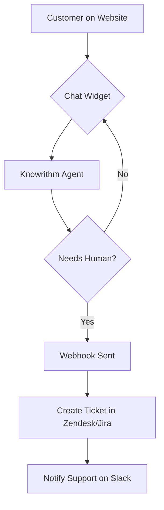
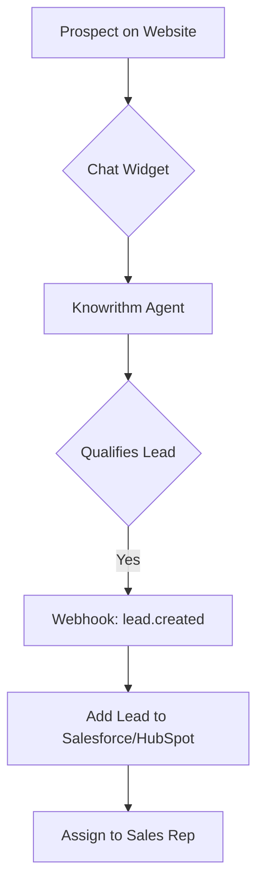

# Integrations

Connect Knowrithm to your existing workflows, websites, and applications. This section provides guides for integrating your AI agents seamlessly into your business ecosystem.

---

## Integration Capabilities

Knowrithm is designed to be highly extensible, allowing you to:

- **Embed Agents on Your Website**: Add a no-code chat widget to any website.
- **Receive Real-time Notifications**: Use webhooks to trigger actions in your systems.
- **Build Custom Solutions**: Leverage our powerful REST API for deep integration.
- **Connect to Third-Party Apps**: Integrate with popular platforms like Slack, Zapier, and more (coming soon).

---

## Core Integrations

<table data-card-size="large" data-view="cards">
  <thead>
    <tr>
      <th></th>
      <th></th>
      <th data-hidden data-card-target data-type="content-ref"></th>
    </tr>
  </thead>
  <tbody>
    <tr>
      <td><strong>Website Chat Widget</strong></td>
      <td>The fastest way to deploy your AI agent. Add a customizable chat widget to your website with a single HTML snippet.</td>
      <td><a href="website-widget.md">website-widget.md</a></td>
    </tr>
    <tr>
      <td><strong>Webhooks</strong></td>
      <td>Get real-time, event-driven notifications pushed to your services when key actions occur, such as a new lead being created or a conversation starting.</td>
      <td><a href="../api-reference/#webhooks">../api-reference/#webhooks</a></td>
    </tr>
    <tr>
      <td><strong>REST API</strong></td>
      <td>For full control and custom integrations, use our comprehensive REST API to build agents, manage conversations, and pull analytics from your own backend.</td>
      <td><a href="../api-reference/">../api-reference/</a></td>
    </tr>
  </tbody>
</table>

---

## Integration Patterns

### Customer Support Automation

1.  A customer interacts with the **Chat Widget** on your site.
2.  The **Knowrithm Agent** handles the conversation.
3.  If human intervention is needed, the agent triggers a **Webhook**.
4.  Your backend service receives the webhook and creates a support ticket in a system like **Zendesk** and notifies your team on **Slack**.

### Lead Generation Funnel

1.  A prospect engages with the **Chat Widget**.
2.  The **Knowrithm Agent** asks qualifying questions.
3.  Once qualified, the agent creates a lead, triggering the `lead.created` **Webhook**.
4.  Your system captures the webhook and pushes the new lead data into your **CRM (e.g., Salesforce)**.

---

## Coming Soon

We are constantly expanding our integration ecosystem. Here are some of the platforms we're working on native integrations for:

- **Slack**: Chat with your Knowrithm agents directly from Slack channels.
- **Zapier**: Connect Knowrithm to thousands of apps with no-code workflows.
- **Salesforce & HubSpot**: Two-way data synchronization for leads and contacts.
- **Zendesk & Intercom**: Seamlessly hand off conversations from AI agents to human support agents.
- **Twilio**: Enable conversations over SMS and WhatsApp.

---

## Custom Integrations

Don't see the integration you need? Our **REST API** and **Python SDK** provide all the tools necessary to build a custom connection to any third-party service.

See the Python SDK Overview for more details.

**Ready to connect Knowrithm?**

Add the Chat Widget to Your Site • Explore the API Reference

