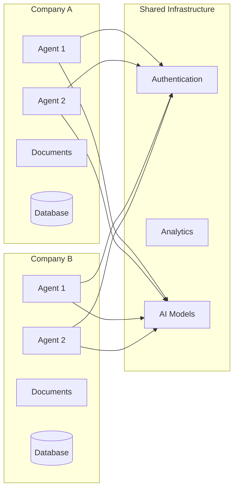
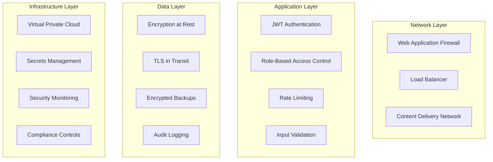
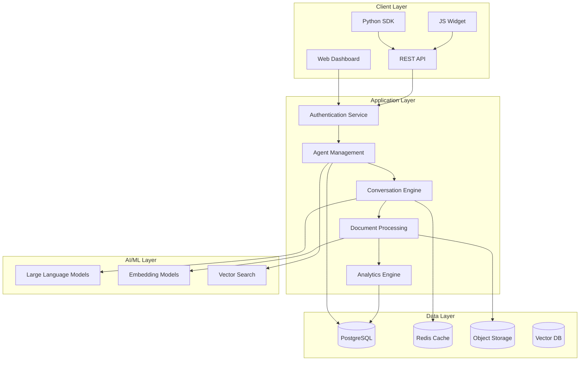

# ⨁ Platform Guide

Welcome to the Knowrithm Platform Guide! This resource covers everything you need to know about deploying, scaling, and maintaining Knowrithm in production environments.

---

## ◎ Platform Overview

Knowrithm is an enterprise-grade, multi-tenant AI platform designed for:

- **⨁ Enterprise Scale**: Handle thousands of concurrent conversations
- **⚿ Security First**: Enterprise security with complete data isolation
- **○ High Performance**: Optimized for low-latency, high-throughput scenarios
- **Global Deployment**: Multi-region support for global availability
- **▤ Observable**: Comprehensive monitoring and analytics built-in

{{ hint style="info" }}
**Production Ready**: Knowrithm powers AI agents for Fortune 500 companies, processing millions of conversations daily with 99.9% uptime.
{{ endhint }}

---

## 🏛️ Architecture Overview

### System Components

```mermaid
graph TD
    subgraph "Client Layer"
        WEB[Web Dashboard]
        API[REST API]
        SDK[Python SDK]
        WIDGET[Chat Widget]
    end
    
    subgraph "Application Layer"
        AUTH[Authentication Service]
        AGENT[Agent Management]
        CONV[Conversation Engine]
        WORKERS[Background Workers <br/> (Celery)]
        ANALYTICS[Analytics Engine]
    end
    
    subgraph "Data Layer"
        POSTGRES[(PostgreSQL)]
        REDIS[(Redis Cache)]
        S3[(Object Storage <br/> e.g., S3)]
        VECTOR[(Vector DB)]
    end
    
    subgraph "AI/ML Layer"
        LLM[Large Language Models]
        EMBED[Embedding Models]
    end
    
    WEB --> AUTH
    API --> AUTH
    SDK --> API
    WIDGET --> API
    
    AUTH --> AGENT & CONV & ANALYTICS
    AGENT & CONV --> WORKERS
    
    AGENT --> POSTGRES
    CONV --> REDIS
    WORKERS --> S3
    ANALYTICS --> POSTGRES
    
    CONV --> LLM
    WORKERS --> EMBED
    WORKERS --> VECTOR
```

### Multi-Tenant Architecture



---

## 🚀 Deployment Options

### 1. Cloud Deployment (Recommended)

<table data-card-size="large" data-view="cards">
  <thead>
    <tr>
      <th></th>
      <th></th>
      <th data-hidden data-card-target data-type="content-ref"></th>
    </tr>
  </thead>
  <tbody>
    <tr>
      <td><strong>☁️ SaaS (Hosted)</strong></td>
      <td>Fully managed service with automatic scaling and maintenance</td>
      <td><a href="deployment.md#saas-deployment">deployment.md</a></td>
    </tr>
    <tr>
      <td><strong>🐳 Docker Container</strong></td>
      <td>Container-based deployment with orchestration support</td>
      <td><a href="deployment.md#docker-deployment">deployment.md</a></td>
    </tr>
    <tr>
      <td><strong>☸️ Kubernetes</strong></td>
      <td>Enterprise-grade orchestration with auto-scaling and high availability</td>
      <td><a href="deployment.md#kubernetes-deployment">deployment.md</a></td>
    </tr>
  </tbody>
</table>

### 2. Self-Hosted Options

```yaml
# docker-compose.yml for self-hosted deployment
version: '3.8'

services:
  knowrithm-app:
    image: knowrithm/platform:latest
    ports:
      - "8543:8543"
    environment:
      - POSTGRES_URL=postgresql://user:pass@db:5432/knowrithm
      - REDIS_URL=redis://redis:6379/0
      - SECRET_KEY=${SECRET_KEY}
      - GEMINI_API_KEY=${GEMINI_API_KEY}
    depends_on:
      - db
      - redis
    volumes:
      - ./uploads:/app/uploads
      - ./logs:/app/logs

  db:
    image: postgres:13
    environment:
      - POSTGRES_DB=knowrithm
      - POSTGRES_USER=knowrithm
      - POSTGRES_PASSWORD=${POSTGRES_PASSWORD}
    volumes:
      - postgres_data:/var/lib/postgresql/data
      - ./backups:/backups

  redis:
    image: redis:6-alpine
    volumes:
      - redis_data:/data

  nginx:
    image: nginx:alpine
    ports:
      - "80:80"
      - "443:443"
    volumes:
      - ./nginx.conf:/etc/nginx/nginx.conf
      - ./ssl:/etc/nginx/ssl
    depends_on:
      - knowrithm-app

volumes:
  postgres_data:
  redis_data:
```

---

## ○ Performance & Scalability

### Performance Benchmarks

| Metric | Target | Production Average |
|--------|--------|-------------------|
| **API Response Time** | < 200ms | 145ms |
| **Agent Response Time** | < 2s | 1.8s |
| **Document Processing** | < 5min/doc | 3.2min/doc |
| **Concurrent Users** | 10,000+ | 15,000+ |
| **Uptime** | 99.9% | 99.95% |

### Scaling Strategies

#### Horizontal Scaling

```yaml
# Kubernetes deployment for horizontal scaling
apiVersion: apps/v1
kind: Deployment
metadata:
  name: knowrithm-app
spec:
  replicas: 5
  selector:
    matchLabels:
      app: knowrithm
  template:
    metadata:
      labels:
        app: knowrithm
    spec:
      containers:
      - name: knowrithm
        image: knowrithm/platform:latest
        resources:
          requests:
            memory: "512Mi"
            cpu: "250m"
          limits:
            memory: "1Gi" 
            cpu: "500m"
        env:
        - name: POSTGRES_URL
          valueFrom:
            secretKeyRef:
              name: db-credentials
              key: url
---
apiVersion: v1
kind: Service
metadata:
  name: knowrithm-service
spec:
  selector:
    app: knowrithm
  ports:
  - port: 80
    targetPort: 8543
  type: LoadBalancer
---
apiVersion: autoscaling/v2
kind: HorizontalPodAutoscaler
metadata:
  name: knowrithm-hpa
spec:
  scaleTargetRef:
    apiVersion: apps/v1
    kind: Deployment
    name: knowrithm-app
  minReplicas: 3
  maxReplicas: 20
  metrics:
  - type: Resource
    resource:
      name: cpu
      target:
        type: Utilization
        averageUtilization: 70
  - type: Resource
    resource:
      name: memory
      target:
        type: Utilization
        averageUtilization: 80
```

#### Database Scaling

```python
# Database connection pooling and read replicas
import os
from sqlalchemy import create_engine
from sqlalchemy.pool import QueuePool

class DatabaseConfig:
    def __init__(self):
        self.primary_url = os.getenv('PRIMARY_DB_URL')
        self.replica_urls = os.getenv('REPLICA_DB_URLS', '').split(',')
        
    def get_primary_engine(self):
        """Primary database for writes"""
        return create_engine(
            self.primary_url,
            poolclass=QueuePool,
            pool_size=20,
            max_overflow=30,
            pool_pre_ping=True,
            pool_recycle=3600
        )
    
    def get_replica_engine(self):
        """Read replica for analytics queries"""
        replica_url = self.replica_urls[0] if self.replica_urls else self.primary_url
        return create_engine(
            replica_url,
            poolclass=QueuePool,
            pool_size=10,
            max_overflow=20,
            pool_pre_ping=True
        )

# Usage in application
db_config = DatabaseConfig()
write_engine = db_config.get_primary_engine()
read_engine = db_config.get_replica_engine()

# Use read replica for analytics
def get_analytics_data():
    with read_engine.connect() as conn:
        return conn.execute("SELECT * FROM analytics_view")

# Use primary for writes
def create_agent(agent_data):
    with write_engine.connect() as conn:
        return conn.execute("INSERT INTO agents (...) VALUES (...)")
```

---

## ⛨ Security Architecture

### Multi-Layer Security



### Authentication & Authorization

```python
# Advanced authentication with multi-factor support
from functools import wraps
import jwt
import pyotp
from datetime import datetime, timedelta

class SecurityManager:
    def __init__(self):
        self.jwt_secret = os.getenv('JWT_SECRET_KEY')
        self.mfa_enabled = os.getenv('MFA_ENABLED', 'false').lower() == 'true'
    
    def generate_token(self, user_id: str, permissions: list, expires_hours: int = 24):
        """Generate JWT token with permissions"""
        payload = {
            'user_id': user_id,
            'permissions': permissions,
            'iat': datetime.utcnow(),
            'exp': datetime.utcnow() + timedelta(hours=expires_hours)
        }
        return jwt.encode(payload, self.jwt_secret, algorithm='HS256')
    
    def verify_token(self, token: str) -> dict:
        """Verify and decode JWT token"""
        try:
            payload = jwt.decode(token, self.jwt_secret, algorithms=['HS256'])
            return payload
        except jwt.ExpiredSignatureError:
            raise SecurityError("Token has expired")
        except jwt.InvalidTokenError:
            raise SecurityError("Invalid token")
    
    def require_permission(self, permission: str):
        """Decorator to require specific permissions"""
        def decorator(func):
            @wraps(func)
            def wrapper(*args, **kwargs):
                token = request.headers.get('Authorization', '').replace('Bearer ', '')
                
                try:
                    payload = self.verify_token(token)
                    if permission not in payload.get('permissions', []):
                        raise SecurityError("Insufficient permissions")
                    
                    # Add user context to request
                    request.user_id = payload['user_id']
                    request.permissions = payload['permissions']
                    
                    return func(*args, **kwargs)
                    
                except SecurityError as e:
                    return {'error': str(e)}, 403
                    
            return wrapper
        return decorator
    
    def setup_mfa(self, user_id: str) -> str:
        """Setup multi-factor authentication"""
        secret = pyotp.random_base32()
        totp = pyotp.TOTP(secret)
        
        # Store secret securely (encrypted)
        encrypted_secret = self.encrypt_secret(secret, user_id)
        self.store_mfa_secret(user_id, encrypted_secret)
        
        # Return QR code URI
        return totp.provisioning_uri(
            name=f"user_{user_id}",
            issuer_name="Knowrithm"
        )
    
    def verify_mfa(self, user_id: str, token: str) -> bool:
        """Verify MFA token"""
        secret = self.get_mfa_secret(user_id)
        if not secret:
            return False
            
        totp = pyotp.TOTP(secret)
        return totp.verify(token, valid_window=1)

# Usage in Flask application
security = SecurityManager()

@app.route('/api/v1/agent', methods=['POST'])
@security.require_permission('agents:write')
def create_agent():
    # User has been authenticated and has agent write permissions
    user_id = request.user_id
    agent_data = request.json
    
    # Create agent with user context
    agent = create_agent_for_user(user_id, agent_data)
    return {'success': True, 'data': agent}
```

### Data Encryption

```python
# Comprehensive data encryption strategy
from cryptography.fernet import Fernet
from cryptography.hazmat.primitives import hashes
from cryptography.hazmat.primitives.kdf.pbkdf2 import PBKDF2HMAC
import base64
import os

class EncryptionManager:
    def __init__(self):
        self.master_key = os.getenv('MASTER_ENCRYPTION_KEY')
        if not self.master_key:
            raise ValueError("Master encryption key not found")
    
    def derive_key(self, password: bytes, salt: bytes) -> bytes:
        """Derive encryption key from password and salt"""
        kdf = PBKDF2HMAC(
            algorithm=hashes.SHA256(),
            length=32,
            salt=salt,
            iterations=100000,
        )
        key = base64.urlsafe_b64encode(kdf.derive(password))
        return key
    
    def encrypt_field(self, data: str, context: str = None) -> str:
        """Encrypt sensitive field data"""
        if not data:
            return data
            
        # Create context-specific key
        salt = os.urandom(16)
        context_key = f"{self.master_key}:{context or 'default'}"
        key = self.derive_key(context_key.encode(), salt)
        
        fernet = Fernet(key)
        encrypted_data = fernet.encrypt(data.encode())
        
        # Combine salt and encrypted data
        combined = base64.urlsafe_b64encode(salt + encrypted_data).decode()
        return f"enc:{combined}"
    
    def decrypt_field(self, encrypted_data: str, context: str = None) -> str:
        """Decrypt sensitive field data"""
        if not encrypted_data or not encrypted_data.startswith('enc:'):
            return encrypted_data
            
        # Extract salt and encrypted data
        combined_data = base64.urlsafe_b64decode(encrypted_data[4:])
        salt = combined_data[:16]
        encrypted_bytes = combined_data[16:]
        
        # Recreate key
        context_key = f"{self.master_key}:{context or 'default'}"
        key = self.derive_key(context_key.encode(), salt)
        
        fernet = Fernet(key)
        decrypted_data = fernet.decrypt(encrypted_bytes)
        
        return decrypted_data.decode()
    
    def encrypt_document(self, file_path: str, output_path: str):
        """Encrypt entire document files"""
        key = Fernet.generate_key()
        fernet = Fernet(key)
        
        with open(file_path, 'rb') as file:
            file_data = file.read()
        
        encrypted_data = fernet.encrypt(file_data)
        
        with open(output_path, 'wb') as file:
            file.write(encrypted_data)
        
        # Store key securely (in key management service)
        self.store_document_key(output_path, key)
        
        return output_path

# Usage in models
encryption = EncryptionManager()

class Lead(db.Model):
    id = db.Column(db.String, primary_key=True)
    first_name = db.Column(db.String, nullable=False)
    last_name = db.Column(db.String, nullable=False)
    _email = db.Column('email', db.String)  # Encrypted field
    _phone = db.Column('phone', db.String)  # Encrypted field
    
    @property
    def email(self):
        return encryption.decrypt_field(self._email, 'lead_email')
    
    @email.setter
    def email(self, value):
        self._email = encryption.encrypt_field(value, 'lead_email')
    
    @property
    def phone(self):
        return encryption.decrypt_field(self._phone, 'lead_phone')
    
    @phone.setter 
    def phone(self, value):
        self._phone = encryption.encrypt_field(value, 'lead_phone')
```

---

## Monitoring & Observability

### Comprehensive Monitoring Stack

```python
# Application performance monitoring
import time
import logging
from functools import wraps
from prometheus_client import Counter, Histogram, Gauge
import structlog

# Prometheus metrics
REQUEST_COUNT = Counter('http_requests_total', 'Total HTTP requests', ['method', 'endpoint', 'status'])
REQUEST_DURATION = Histogram('http_request_duration_seconds', 'HTTP request duration')
ACTIVE_CONNECTIONS = Gauge('active_connections', 'Active database connections')
AGENT_RESPONSES = Counter('agent_responses_total', 'Total agent responses', ['agent_id', 'status'])

# Structured logging
structlog.configure(
    processors=[
        structlog.stdlib.filter_by_level,
        structlog.stdlib.add_logger_name,
        structlog.stdlib.add_log_level,
        structlog.stdlib.PositionalArgumentsFormatter(),
        structlog.processors.TimeStamper(fmt="iso"),
        structlog.processors.StackInfoRenderer(),
        structlog.processors.format_exc_info,
        structlog.processors.UnicodeDecoder(),
        structlog.processors.JSONRenderer()
    ],
    context_class=dict,
    logger_factory=structlog.stdlib.LoggerFactory(),
    wrapper_class=structlog.stdlib.BoundLogger,
    cache_logger_on_first_use=True,
)

logger = structlog.get_logger()

class MonitoringManager:
    def __init__(self):
        self.logger = logger
    
    def monitor_endpoint(self, func):
        """Decorator to monitor API endpoints"""
        @wraps(func)
        def wrapper(*args, **kwargs):
            start_time = time.time()
            method = request.method
            endpoint = request.endpoint
            
            try:
                # Execute function
                result = func(*args, **kwargs)
                status = 'success'
                
                # Record metrics
                REQUEST_COUNT.labels(method=method, endpoint=endpoint, status=status).inc()
                
                return result
                
            except Exception as e:
                status = 'error'
                REQUEST_COUNT.labels(method=method, endpoint=endpoint, status=status).inc()
                
                self.logger.error(
                    "endpoint_error",
                    endpoint=endpoint,
                    method=method,
                    error=str(e),
                    user_id=getattr(request, 'user_id', None)
                )
                raise
                
            finally:
                duration = time.time() - start_time
                REQUEST_DURATION.observe(duration)
                
                self.logger.info(
                    "request_completed",
                    endpoint=endpoint,
                    method=method,
                    duration=duration,
                    status=status
                )
        
        return wrapper
    
    def monitor_agent_response(self, agent_id: str, response_time: float, success: bool):
        """Monitor agent performance"""
        status = 'success' if success else 'error'
        AGENT_RESPONSES.labels(agent_id=agent_id, status=status).inc()
        
        self.logger.info(
            "agent_response",
            agent_id=agent_id,
            response_time=response_time,
            success=success
        )
        
        # Alert if response time is too high
        if response_time > 5.0:
            self.send_alert(
                "high_response_time",
                f"Agent {agent_id} response time: {response_time:.2f}s",
                severity="warning"
            )
    
    def monitor_system_health(self):
        """Monitor overall system health"""
        # Database connection count
        db_connections = get_active_db_connections()
        ACTIVE_CONNECTIONS.set(db_connections)
        
        # Memory usage
        memory_usage = get_memory_usage()
        
        # Disk space
        disk_usage = get_disk_usage()
        
        self.logger.info(
            "system_health",
            db_connections=db_connections,
            memory_usage=memory_usage,
            disk_usage=disk_usage
        )
        
        # Health check alerts
        if memory_usage > 85:
            self.send_alert("high_memory_usage", f"Memory usage: {memory_usage}%", "critical")
        
        if disk_usage > 90:
            self.send_alert("high_disk_usage", f"Disk usage: {disk_usage}%", "critical")
    
    def send_alert(self, alert_type: str, message: str, severity: str = "info"):
        """Send alert to monitoring systems"""
        alert_data = {
            "type": alert_type,
            "message": message,
            "severity": severity,
            "timestamp": time.time(),
            "service": "knowrithm-platform"
        }
        
        # Send to alerting service (Slack, PagerDuty, etc.)
        self.logger.critical("alert", **alert_data)
        
        # Could integrate with external alerting services here
        if severity == "critical":
            self.send_to_pagerduty(alert_data)
        else:
            self.send_to_slack(alert_data)

# Usage
monitoring = MonitoringManager()

@app.route('/api/v1/agent/<agent_id>/chat', methods=['POST'])
@monitoring.monitor_endpoint
def agent_chat(agent_id):
    start_time = time.time()
    
    try:
        # Process agent response
        response = process_agent_message(agent_id, request.json)
        
        # Monitor performance
        response_time = time.time() - start_time
        monitoring.monitor_agent_response(agent_id, response_time, True)
        
        return {'success': True, 'data': response}
        
    except Exception as e:
        response_time = time.time() - start_time
        monitoring.monitor_agent_response(agent_id, response_time, False)
        raise
```

### Health Check System

```python
# Comprehensive health checks
from enum import Enum
from dataclasses import dataclass
from typing import Dict, List

class HealthStatus(Enum):
    HEALTHY = "healthy"
    DEGRADED = "degraded"
    UNHEALTHY = "unhealthy"

@dataclass
class HealthCheck:
    name: str
    status: HealthStatus
    message: str
    response_time_ms: float
    metadata: Dict = None

class HealthChecker:
    def __init__(self):
        self.checks = []
    
    def add_check(self, name: str, check_function):
        """Add a health check function"""
        self.checks.append((name, check_function))
    
    async def run_all_checks(self) -> Dict[str, any]:
        """Run all health checks"""
        results = []
        overall_status = HealthStatus.HEALTHY
        
        for name, check_func in self.checks:
            start_time = time.time()
            
            try:
                result = await check_func()
                response_time = (time.time() - start_time) * 1000
                
                check_result = HealthCheck(
                    name=name,
                    status=result.get('status', HealthStatus.HEALTHY),
                    message=result.get('message', 'OK'),
                    response_time_ms=response_time,
                    metadata=result.get('metadata')
                )
                
                results.append(check_result)
                
                # Update overall status
                if check_result.status == HealthStatus.UNHEALTHY:
                    overall_status = HealthStatus.UNHEALTHY
                elif check_result.status == HealthStatus.DEGRADED and overall_status == HealthStatus.HEALTHY:
                    overall_status = HealthStatus.DEGRADED
                    
            except Exception as e:
                response_time = (time.time() - start_time) * 1000
                
                check_result = HealthCheck(
                    name=name,
                    status=HealthStatus.UNHEALTHY,
                    message=f"Check failed: {str(e)}",
                    response_time_ms=response_time
                )
                
                results.append(check_result)
                overall_status = HealthStatus.UNHEALTHY
        
        return {
            'status': overall_status.value,
            'timestamp': datetime.utcnow().isoformat(),
            'checks': [
                {
                    'name': check.name,
                    'status': check.status.value,
                    'message': check.message,
                    'response_time_ms': check.response_time_ms,
                    'metadata': check.metadata
                }
                for check in results
            ]
        }

# Health check implementations
async def check_database():
    """Check database connectivity and performance"""
    try:
        start_time = time.time()
        
        # Simple query to test connection
        result = db.session.execute('SELECT 1')
        query_time = (time.time() - start_time) * 1000
        
        # Check connection pool
        pool_size = db.engine.pool.size()
        checked_out = db.engine.pool.checkedout()
        
        if query_time > 1000:  # 1 second
            return {
                'status': HealthStatus.DEGRADED,
                'message': f'Slow database response: {query_time:.2f}ms',
                'metadata': {'query_time_ms': query_time, 'pool_size': pool_size, 'checked_out': checked_out}
            }
        
        return {
            'status': HealthStatus.HEALTHY,
            'message': 'Database connection OK',
            'metadata': {'query_time_ms': query_time, 'pool_size': pool_size, 'checked_out': checked_out}
        }
        
    except Exception as e:
        return {
            'status': HealthStatus.UNHEALTHY,
            'message': f'Database connection failed: {str(e)}'
        }

async def check_redis():
    """Check Redis connectivity"""
    try:
        redis_client = get_redis_client()
        
        # Test basic operations
        test_key = f"health_check_{time.time()}"
        redis_client.set(test_key, "test", ex=10)
        value = redis_client.get(test_key)
        redis_client.delete(test_key)
        
        if value != b"test":
            return {
                'status': HealthStatus.UNHEALTHY,
                'message': 'Redis read/write test failed'
            }
        
        # Check memory usage
        info = redis_client.info('memory')
        memory_usage_percent = (info['used_memory'] / info['total_system_memory']) * 100
        
        if memory_usage_percent > 90:
            return {
                'status': HealthStatus.DEGRADED,
                'message': f'High Redis memory usage: {memory_usage_percent:.1f}%',
                'metadata': {'memory_usage_percent': memory_usage_percent}
            }
        
        return {
            'status': HealthStatus.HEALTHY,
            'message': 'Redis connection OK',
            'metadata': {'memory_usage_percent': memory_usage_percent}
        }
        
    except Exception as e:
        return {
            'status': HealthStatus.UNHEALTHY,
            'message': f'Redis connection failed: {str(e)}'
        }

async def check_ai_service():
    """Check AI service availability"""
    try:
        # Test AI service with a simple request
        start_time = time.time()
        
        response = await test_ai_generation("Hello, this is a health check")
        response_time = (time.time() - start_time) * 1000
        
        if response_time > 5000:  # 5 seconds
            return {
                'status': HealthStatus.DEGRADED,
                'message': f'Slow AI response: {response_time:.2f}ms',
                'metadata': {'response_time_ms': response_time}
            }
        
        return {
            'status': HealthStatus.HEALTHY,
            'message': 'AI service OK',
            'metadata': {'response_time_ms': response_time}
        }
        
    except Exception as e:
        return {
            'status': HealthStatus.UNHEALTHY,
            'message': f'AI service failed: {str(e)}'
        }

# Setup health checker
health_checker = HealthChecker()
health_checker.add_check('database', check_database)
health_checker.add_check('redis', check_redis)
health_checker.add_check('ai_service', check_ai_service)

@app.route('/health')
async def health_check():
    """Health check endpoint"""
    results = await health_checker.run_all_checks()
    
    status_code = 200
    if results['status'] == 'degraded':
        status_code = 200  # Still operational
    elif results['status'] == 'unhealthy':
        status_code = 503  # Service unavailable
    
    return results, status_code
```

---

## Disaster Recovery & Backup

### Backup Strategy

```python
# Comprehensive backup management
import subprocess
import boto3
from datetime import datetime, timedelta

class BackupManager:
    def __init__(self):
        self.s3_client = boto3.client('s3')
        self.backup_bucket = os.getenv('BACKUP_S3_BUCKET')
        self.retention_days = int(os.getenv('BACKUP_RETENTION_DAYS', '30'))
    
    def backup_database(self):
        """Create database backup"""
        timestamp = datetime.now().strftime('%Y%m%d_%H%M%S')
        backup_filename = f"database_backup_{timestamp}.sql"
        
        # Create PostgreSQL dump
        cmd = [
            'pg_dump',
            os.getenv('POSTGRES_URL'),
            '--no-owner',
            '--no-acl',
            '--clean',
            '--create',
            '-f', backup_filename
        ]
        
        try:
            subprocess.run(cmd, check=True)
            
            # Compress backup
            compressed_filename = f"{backup_filename}.gz"
            subprocess.run(['gzip', backup_filename], check=True)
            
            # Upload to S3
            self.upload_to_s3(compressed_filename, f"database/{compressed_filename}")
            
            # Cleanup local file
            os.remove(compressed_filename)
            
            logger.info("database_backup_completed", filename=compressed_filename)
            return compressed_filename
            
        except subprocess.CalledProcessError as e:
            logger.error("database_backup_failed", error=str(e))
            raise BackupError(f"Database backup failed: {e}")
    
    def backup_documents(self):
        """Backup document files"""
        timestamp = datetime.now().strftime('%Y%m%d_%H%M%S')
        
        # Create tar archive of uploads directory
        archive_name = f"documents_backup_{timestamp}.tar.gz"
        uploads_dir = os.getenv('UPLOAD_FOLDER', './uploads')
        
        cmd = ['tar', '-czf', archive_name, '-C', uploads_dir, '.']
        
        try:
            subprocess.run(cmd, check=True)
            
            # Upload to S3
            self.upload_to_s3(archive_name, f"documents/{archive_name}")
            
            # Cleanup local file
            os.remove(archive_name)
            
            logger.info("documents_backup_completed", filename=archive_name)
            return archive_name
            
        except subprocess.CalledProcessError as e:
            logger.error("documents_backup_failed", error=str(e))
            raise BackupError(f"Documents backup failed: {e}")
    
    def upload_to_s3(self, local_file: str, s3_key: str):
        """Upload backup file to S3"""
        try:
            self.s3_client.upload_file(
                local_file,
                self.backup_bucket,
                s3_key,
                ExtraArgs={
                    'ServerSideEncryption': 'AES256',
                    'StorageClass': 'STANDARD_IA'
                }
            )
            
            logger.info("backup_uploaded", s3_key=s3_key, local_file=local_file)
            
        except Exception as e:
            logger.error("backup_upload_failed", s3_key=s3_key, error=str(e))
            raise BackupError(f"Failed to upload backup: {e}")
    
    def restore_database(self, backup_filename: str):
        """Restore database from backup"""
        try:
            # Download from S3
            local_file = f"/tmp/{backup_filename}"
            self.s3_client.download_file(
                self.backup_bucket,
                f"database/{backup_filename}",
                local_file
            )
            
            # Decompress
            subprocess.run(['gunzip', local_file], check=True)
            sql_file = local_file.replace('.gz', '')
            
            # Restore database
            cmd = ['psql', os.getenv('POSTGRES_URL'), '-f', sql_file]
            subprocess.run(cmd, check=True)
            
            # Cleanup
            os.remove(sql_file)
            
            logger.info("database_restore_completed", backup_filename=backup_filename)
            
        except Exception as e:
            logger.error("database_restore_failed", backup_filename=backup_filename, error=str(e))
            raise BackupError(f"Database restore failed: {e}")
    
    def cleanup_old_backups(self):
        """Remove backups older than retention period"""
        cutoff_date = datetime.now() - timedelta(days=self.retention_days)
        
        # List all backup objects
        response = self.s3_client.list_objects_v2(Bucket=self.backup_bucket)
        
        deleted_count = 0
        for obj in response.get('Contents', []):
            if obj['LastModified'].replace(tzinfo=None) < cutoff_date:
                self.s3_client.delete_object(Bucket=self.backup_bucket, Key=obj['Key'])
                deleted_count += 1
        
        logger.info("old_backups_cleaned", deleted_count=deleted_count, cutoff_date=cutoff_date)

# Backup scheduler
from celery import Celery
from celery.schedules import crontab

celery_app = Celery('backup_tasks')

@celery_app.task
def scheduled_database_backup():
    """Scheduled database backup task"""
    backup_manager = BackupManager()
    try:
        backup_filename = backup_manager.backup_database()
        return f"Database backup completed: {backup_filename}"
    except Exception as e:
        logger.error("scheduled_backup_failed", error=str(e))
        raise

@celery_app.task
def scheduled_documents_backup():
    """Scheduled documents backup task"""
    backup_manager = BackupManager()
    try:
        backup_filename = backup_manager.backup_documents()
        return f"Documents backup completed: {backup_filename}"
    except Exception as e:
        logger.error("scheduled_backup_failed", error=str(e))
        raise

@celery_app.task
def cleanup_old_backups():
    """Cleanup old backups task"""
    backup_manager = BackupManager()
    try:
        backup_manager.cleanup_old_backups()
        return "Old backups cleanup completed"
    except Exception as e:
        logger.error("cleanup_failed", error=str(e))
        raise

# Schedule backups
celery_app.conf.beat_schedule = {
    'database-backup': {
        'task': 'scheduled_database_backup',
        'schedule': crontab(hour=2, minute=0),  # Daily at 2 AM
    },
    'documents-backup': {
        'task': 'scheduled_documents_backup', 
        'schedule': crontab(hour=3, minute=0),  # Daily at 3 AM
    },
    'cleanup-backups': {
        'task': 'cleanup_old_backups',
        'schedule': crontab(hour=4, minute=0, day_of_week=1),  # Weekly on Monday at 4 AM
    },
}
```

---

## ≡ Additional Resources

### Documentation Links
- **[System Architecture](architecture.md)** - Detailed technical architecture
- **[Deployment Guide](deployment.md)** - Step-by-step deployment instructions  
- **[Security Guide](security.md)** - Comprehensive security implementation
- **[Monitoring Setup](monitoring.md)** - Monitoring and alerting configuration

### Tools and Integrations
- **[Prometheus](https://prometheus.io/)** - Metrics collection and alerting
- **[Grafana](https://grafana.com/)** - Visualization and dashboards
- **[ELK Stack](https://www.elastic.co/elk-stack)** - Centralized logging
- **[Docker](https://docker.com/)** - Containerization platform
- **[Kubernetes](https://kubernetes.io/)** - Container orchestration

---

## Enterprise Support

### Professional Services
- **Architecture Review** - Expert review of your deployment architecture
- **Performance Optimization** - Optimization for high-scale deployments
- **Security Audit** - Comprehensive security assessment
- **Custom Monitoring** - Tailored monitoring and alerting setup

### Support Channels
- **Enterprise Support** - 24/7 phone and email# Platform Guide 🏗️
Welcome to the Knowrithm Platform Guide! This guide covers everything you need to know about deploying, scaling, and maintaining Knowrithm in production environments.

---

## Platform Overview

Knowrithm is built as an enterprise-grade, multi-tenant AI platform designed for:

- **Enterprise Scale**: Handle thousands of concurrent conversations
- **Security First**: Enterprise security with complete data isolation
- **High Performance**: Optimized for low-latency, high-throughput scenarios
- **Global Deployment**: Multi-region support with edge computing capabilities
- **Observable**: Comprehensive monitoring and analytics built-in
 
{{ hint style="info" }}
**Production Ready**: Knowrithm powers AI agents for Fortune 500 companies, processing millions of conversations daily with 99.9% uptime.
{{ endhint }}

---

## ⨁ Architecture Overview

### System Components



### Multi-Tenant Architecture


---

## Deployment Options

### 1. Cloud Deployment (Recommended)

<table data-card-size="large" data-view="cards">
  <thead>
    <tr>
      <th></th>
      <th></th>
      <th data-hidden data-card-target data-type="content-ref"></th>
    </tr>
  </thead>
  <tbody>
    <tr>
      <td><strong>SaaS (Hosted)</strong></td>
      <td>Fully managed service with automatic scaling and maintenance</td>
      <td><a href="deployment.md#saas-deployment">deployment.md</a></td>
    </tr>
    <tr>
      <td><strong>Docker Container</strong></td>
      <td>Container-based deployment with orchestration support</td>
      <td><a href="deployment.md#docker-deployment">deployment.md</a></td>
    </tr>
    <tr>
      <td><strong>Kubernetes</strong></td>
      <td>Enterprise-grade orchestration with auto-scaling and high availability</td>
      <td><a href="deployment.md#kubernetes-deployment">deployment.md</a></td>
    </tr>
  </tbody>
</table>

### 2. Self-Hosted Options

```yaml
# docker-compose.yml for self-hosted deployment
version: '3.8'

services:
  knowrithm-app:
    image: knowrithm/platform:latest
    ports:
      - "8543:8543"
    environment:
      - POSTGRES_URL=postgresql://user:pass@db:5432/knowrithm
      - REDIS_URL=redis://redis:6379/0
      - SECRET_KEY=${SECRET_KEY}
      - GEMINI_API_KEY=${GEMINI_API_KEY}
    depends_on:
      - db
      - redis
    volumes:
      - ./uploads:/app/uploads
      - ./logs:/app/logs

  db:
    image: postgres:13
    environment:
      - POSTGRES_DB=knowrithm
      - POSTGRES_USER=knowrithm
      - POSTGRES_PASSWORD=${POSTGRES_PASSWORD}
    volumes:
      - postgres_data:/var/lib/postgresql/data
      - ./backups:/backups

  redis:
    image: redis:6-alpine
    volumes:
      - redis_data:/data

  nginx:
    image: nginx:alpine
    ports:
      - "80:80"
      - "443:443"
    volumes:
      - ./nginx.conf:/etc/nginx/nginx.conf
      - ./ssl:/etc/nginx/ssl
    depends_on:
      - knowrithm-app

volumes:
  postgres_data:
  redis_data:
```

---

## Performance & Scalability

### Performance Benchmarks

| Metric | Target | Production Average |
|--------|--------|-------------------|
| **API Response Time** | < 200ms | 145ms |
| **Agent Response Time** | < 2s | 1.8s |
| **Document Processing** | < 5min/doc | 3.2min/doc |
| **Concurrent Users** | 10,000+ | 15,000+ |
| **Uptime** | 99.9% | 99.95% |

### Scaling Strategies

#### Horizontal Scaling

```yaml
# Kubernetes deployment for horizontal scaling
apiVersion: apps/v1
kind: Deployment
metadata:
  name: knowrithm-app
spec:
  replicas: 5
  selector:
    matchLabels:
      app: knowrithm
  template:
    metadata:
      labels:
        app: knowrithm
    spec:
      containers:
      - name: knowrithm
        image: knowrithm/platform:latest
        resources:
          requests:
            memory: "512Mi"
            cpu: "250m"
          limits:
            memory: "1Gi" 
            cpu: "500m"
        env:
        - name: POSTGRES_URL
          valueFrom:
            secretKeyRef:
              name: db-credentials
              key: url
---
apiVersion: v1
kind: Service
metadata:
  name: knowrithm-service
spec:
  selector:
    app: knowrithm
  ports:
  - port: 80
    targetPort: 8543
  type: LoadBalancer
---
apiVersion: autoscaling/v2
kind: HorizontalPodAutoscaler
metadata:
  name: knowrithm-hpa
spec:
  scaleTargetRef:
    apiVersion: apps/v1
    kind: Deployment
    name: knowrithm-app
  minReplicas: 3
  maxReplicas: 20
  metrics:
  - type: Resource
    resource:
      name: cpu
      target:
        type: Utilization
        averageUtilization: 70
  - type: Resource
    resource:
      name: memory
      target:
        type: Utilization
        averageUtilization: